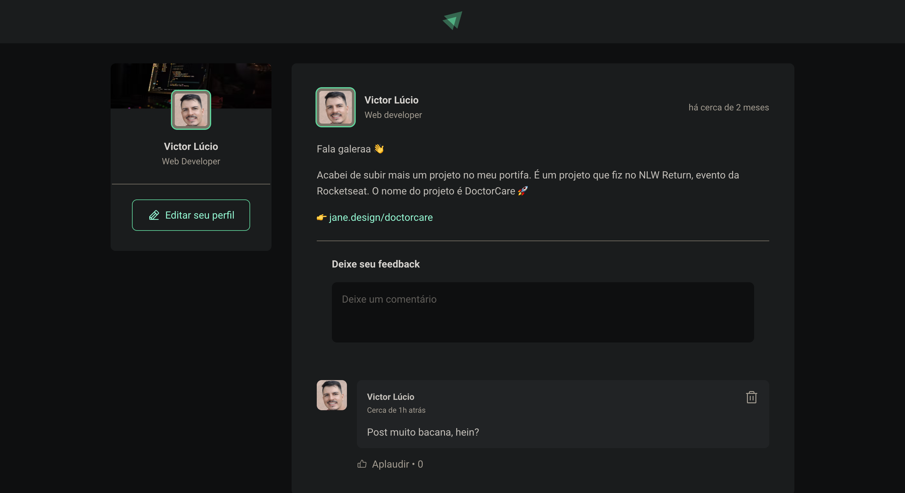

<h1 align="center"> Web-Feed</h1>

  <a href="#-tecnologias">Tecnologias</a>&nbsp;&nbsp;&nbsp;|&nbsp;&nbsp;&nbsp;
  <a href="#-projeto">Projeto</a>&nbsp;&nbsp;&nbsp;|&nbsp;&nbsp;&nbsp;
  <a href="#-layout">Layout</a>&nbsp;&nbsp;&nbsp;|&nbsp;&nbsp;&nbsp;
  <a href="#memo-licença">Licença</a>

  

 

  

## 🚀 Tecnologias

Esse projeto foi desenvolvido com as seguintes tecnologias:

- HTML e CSS
- JavaScript
- Git e Github
- Figma

## 💻 Projeto

Web-Feed é um feed aonde pode adicionar, remover comentarios como também ter reações de curtir (aqui chamado de aplaudir).

## 🔖 Layout

Você pode visualizar o layout do projeto através [DESSE LINK](https://www.figma.com/file/5tiN6i1q925NIGcqORbSaq/Ignite-Feed-(Community)?type=design&node-id=26-12&t=cfcNS0Cm24sKDJBR-0). É necessário ter conta no [Figma](https://figma.com) para acessá-lo.

## :memo: Licença

Esse projeto está sob a licença MIT.

---

Feito a partir das aulas da Rocketseat [Ignit aulas](https://app.rocketseat.com.br/ignite)
